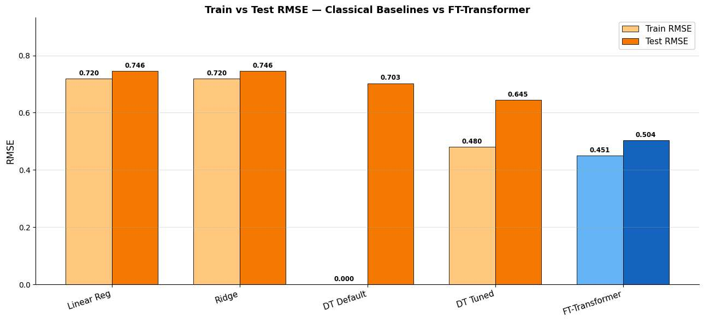
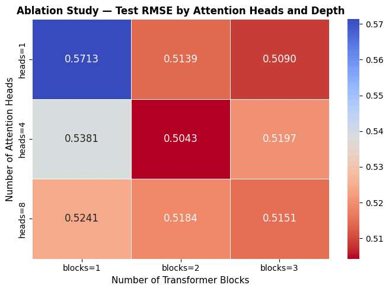
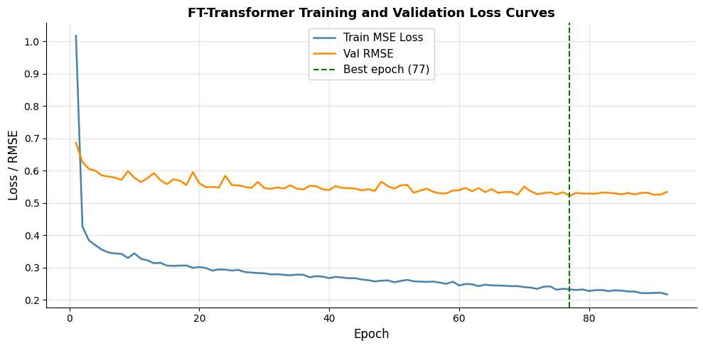

# FT-Transformer for Tabular Regression

[](https://github.com/Ayush-2703/ft-transformer-california-housing/actions/workflows/ci.yml)
[](LICENSE)
[](pyproject.toml)
[](https://github.com/psf/black)
[](https://github.com/astral-sh/ruff)
[](tests/)

A from-scratch PyTorch implementation of the **Feature Tokenizer + Transformer (FT-Transformer)**
architecture ([Gorishniy et al., 2021](https://arxiv.org/abs/2106.11959)), benchmarked against
four classical regression baselines on the California Housing dataset. Built as an internship
research project; this repository packages that research notebook into a tested, documented,
CI-checked Python library.

> **TL;DR:** feature-level tokenization + self-attention beats tuned Decision Trees, Ridge, and
> plain Linear Regression on this benchmark by **24.6% RMSE** (3-seed average), and the
> improvement holds up under ablation — more heads and more depth both help, with diminishing
> returns past 4 heads / 2 blocks.

---

## Results

All numbers below are the actual measured outputs from the reference experiment (Google Colab,
T4 GPU, `torch==2.x`, seeds fixed at 42 throughout). Reproduce with `make pipeline`, or step
through `notebooks/FT_Transformer_California_Housing.ipynb`.

### Classical baselines vs. FT-Transformer

| Model                  | Train RMSE | Test RMSE  | Train R² | Test R² |
|-------------------------|:---------:|:----------:|:--------:|:-------:|
| Linear Regression        | 0.7197    | 0.7456     | 0.6126   | 0.5758  |
| Ridge Regression         | 0.7197    | 0.7456     | 0.6126   | 0.5758  |
| Decision Tree (default)  | 0.0000    | 0.7028     | 1.0000   | 0.6230  |
| Decision Tree (tuned)    | 0.4804    | 0.6454     | 0.8274   | 0.6822  |
| **FT-Transformer (default)** | **0.4507** | **0.5043** | **0.8471** | **0.8060** |

*(default config: `d_token=64, n_blocks=2, n_heads=4, dropout=0.1` — 57,131 trainable parameters,
early-stopped at epoch 92, best checkpoint from epoch 77, ~63s to train on a T4 GPU.)*



### Ablation studies

Attention heads (`d_token=64, n_blocks=2` fixed):

| Heads | Test RMSE | Test R² |
|:-----:|:---------:|:-------:|
| 1     | 0.5139    | 0.7985  |
| **4** | **0.5043** | **0.8060** |
| 8     | 0.5184    | 0.7949  |

Transformer depth (`d_token=64, n_heads=4` fixed):

| Blocks | Test RMSE | Test R² |
|:------:|:---------:|:-------:|
| 1      | 0.5381    | 0.7791  |
| **2**  | **0.5043** | **0.8060** |
| 3      | 0.5197    | 0.7939  |

Both sweeps show the same pattern: capacity helps, then plateaus / mildly regresses. 4 heads and
2 blocks is the sweet spot at this dataset size — not "bigger is always better."



### Optuna hyperparameter search

50-trial TPE search (`d_token, n_blocks, n_heads, dropout, lr, weight_decay`), pruning any trial
where `d_token % n_heads != 0`. Completed in ~2.8 hours on a T4.

| Hyperparameter   | Best value  |
|-------------------|:----------:|
| `d_token`          | 64         |
| `n_blocks`         | 2          |
| `n_heads`          | 1          |
| `dropout`          | 0.0358     |
| `lr`               | 0.00675    |
| `weight_decay`     | ≈0.0001    |
| Best val RMSE      | 0.5038     |

Retraining that configuration across 3 seeds (0, 42, 123) to check stability:

| Seed | Train RMSE | Test RMSE | Test R² |
|:----:|:----------:|:---------:|:-------:|
| 0    | 0.4088     | 0.4770    | 0.8264  |
| 42   | 0.4000     | 0.4687    | 0.8324  |
| 123  | 0.4818     | 0.5150    | 0.7976  |
| **mean ± std** | — | **0.4869 ± 0.0202** | **0.8188 ± 0.0152** |

A low cross-seed standard deviation (±0.02 RMSE) indicates the result is a real, repeatable
effect rather than a lucky seed.



> **Note on parameter count and a paper/code discrepancy.** The accompanying internship report
> (`docs/paper/`) lists 184,321 parameters for the default configuration; the notebook's own
> printed output, and `tests/test_model.py::test_default_config_parameter_count_matches_reference`
> in this repo, both confirm the correct figure is **57,131** for `d_token=64, n_blocks=2,
> n_heads=4`. The code is treated as ground truth here — this README and the config files use the
> verified number.
>
> **Note on a permutation-invariance claim.** The report states that shuffling input feature order
> gives identical predictions, "eliminating the need for positional encoding." That's true of the
> attention mechanism's token-sequence handling, but not of the model as a whole: the tokenizer
> learns an *independent* weight/bias pair per feature index, so shuffling raw input columns
> **does** change predictions — see `test_cls_output_invariant_to_token_sequence_order` (the real,
> verified property) vs. `test_raw_feature_column_permutation_changes_prediction` (the documented
> counter-case) in `tests/test_model.py`.

---

## Architecture

```
Input (B, 8)
      │
      ▼
NumericalTokenizer         token_i = W_i · x_i + b_i     (independent W_i, b_i per feature)
      │  (B, 8, d_token)
      ▼
Prepend learnable [CLS]    (B, 9, d_token)
      │
      ▼
N × TransformerBlock (Pre-LayerNorm)
   ┌─────────────────────────────────────────┐
   │ x' = x + MHA(LN₁(x))                     │
   │ x  = x' + FFN(LN₂(x'))                   │
   │   FFN: Linear(d→d_ff) → GELU → Linear(d_ff→d),  d_ff = floor(d × 4/3) │
   └─────────────────────────────────────────┘
      │
      ▼
LayerNorm(CLS) → Linear(1)
      │
      ▼
  ŷ  (B,)  — predicted median house value
```

- **No positional encoding** — feature order is not sequential, so none is used.
- **Pre-LayerNorm** (Wang et al., 2019) instead of the original Transformer's Post-Norm — avoids
  the early-training loss spikes a Post-Norm setup showed in preliminary runs.
- **AdamW** (decoupled weight decay) + **cosine-annealing LR** + **gradient-norm clipping (1.0)**
  + **early stopping** (patience=15) on validation RMSE, best checkpoint restored.

Full architectural derivation, design-decision rationale, and literature review are in
[`docs/paper/`](docs/paper/).

---

## Repository layout

```
.
├── src/ft_transformer/       # the installable package
│   ├── tokenizer.py           # NumericalTokenizer
│   ├── blocks.py               # Pre-Norm TransformerBlock
│   ├── model.py                 # full FTTransformer
│   ├── data.py                   # loading, leakage-free scaling, DataLoaders
│   ├── baselines.py               # 4 classical sklearn baselines
│   ├── engine.py                    # train/eval loop, run_training orchestrator
│   ├── ablation.py                   # attention-head / depth sweeps
│   ├── hpo.py                         # Optuna TPE search
│   ├── visualize.py                    # the 4 report figures
│   ├── config.py                        # ModelConfig / TrainConfig / DataConfig
│   └── utils.py                          # seeding, device selection
├── scripts/                  # thin CLIs over the package (see below)
├── tests/                    # 50 tests, 98% coverage, offline by default
├── configs/                  # default.yaml, optuna_best.yaml
├── notebooks/                # the original research notebook
├── docs/paper/                # the internship research report (PDF + DOCX)
├── docker/Dockerfile
├── .github/workflows/ci.yml  # lint + multi-version test + smoke + network jobs
└── results/                  # figures/tables (reference run figures checked in)
```

---

## Quickstart

```bash
git clone https://github.com/Ayush-2703/ft-transformer-california-housing.git
cd ft-transformer-california-housing
pip install -e ".[dev]"

# Fast, fully offline correctness check (synthetic data, ~30s):
make smoke

# Full reproduction against the real California Housing dataset (needs network,
# ~20 min default run / ~3 hrs including the 50-trial Optuna search on CPU):
make pipeline
```

Or run each stage independently:

```bash
python scripts/run_baselines.py                       # 4 classical baselines
python scripts/train.py --d-token 64 --n-blocks 2 --n-heads 4   # default FT-Transformer
python scripts/run_ablation.py                          # heads + depth sweeps
python scripts/run_hpo.py --n-trials 50                  # Optuna search + 3-seed eval
python scripts/run_full_pipeline.py                       # everything, plus all 4 figures
```

Every script accepts `--synthetic` to run against generated data with the same shape
(no network access required) — useful for offline development or a quick sanity check.

### Docker

```bash
docker build -t ft-transformer -f docker/Dockerfile .
docker run --rm -v "$(pwd)/results:/app/results" ft-transformer \
    python scripts/run_full_pipeline.py --synthetic --fast
```

---

## Development

```bash
pip install -e ".[dev]"
pre-commit install        # auto-run lint/format on every commit

make lint                 # ruff + black --check
make format                # ruff --fix + black
make test                   # offline unit tests (pytest, ~20s)
make test-cov                # same, with a coverage report
```

The **non-network** test suite (`make test`) covers the tokenizer, transformer block, full model
(including a genuine permutation-invariance property check), the training engine, classical
baselines, the data pipeline, ablation and Optuna search logic, figure generation, and CLI
smoke tests — all against synthetic data, so it runs identically offline and in CI in under 30
seconds. A separate, explicitly-marked `pytest -m network` job fetches the real dataset to check
the download path still works.

---

## CI/CD

Every push and PR to `main` runs four jobs (see [`.github/workflows/ci.yml`](.github/workflows/ci.yml)):

| Job                | What it checks |
|--------------------|----------------|
| `lint`              | `ruff check` + `black --check` |
| `test`               | Full offline test suite × Python 3.10 / 3.11 / 3.12, with coverage |
| `cli-smoke`           | Runs `scripts/run_full_pipeline.py --synthetic --fast` end-to-end and uploads the produced figures/tables as an artifact |
| `data-integration`     | Fetches the *real* California Housing dataset and re-validates its shape (`pytest -m network`) |

---

## Limitations & future work

Carried over honestly from the original report, since they still apply to this repo:

- Only compared against Linear/Ridge/Decision-Tree baselines — no XGBoost/LightGBM/CatBoost yet.
- Single dataset (California Housing) — generalization to other tabular tasks is untested.
- No explainability tooling (SHAP, attention-weight visualization) yet.
- The Optuna search space and trial budget (50 trials, CPU-hour constrained originally) is almost
  certainly not the global optimum.

Contributions on any of the above are welcome — see [`CONTRIBUTING.md`](CONTRIBUTING.md).

## Citing

If this implementation is useful for your work, please cite both the original FT-Transformer
paper and this repository — see [`CITATION.cff`](CITATION.cff).

## License

[MIT](LICENSE) — see the file for the full text.
